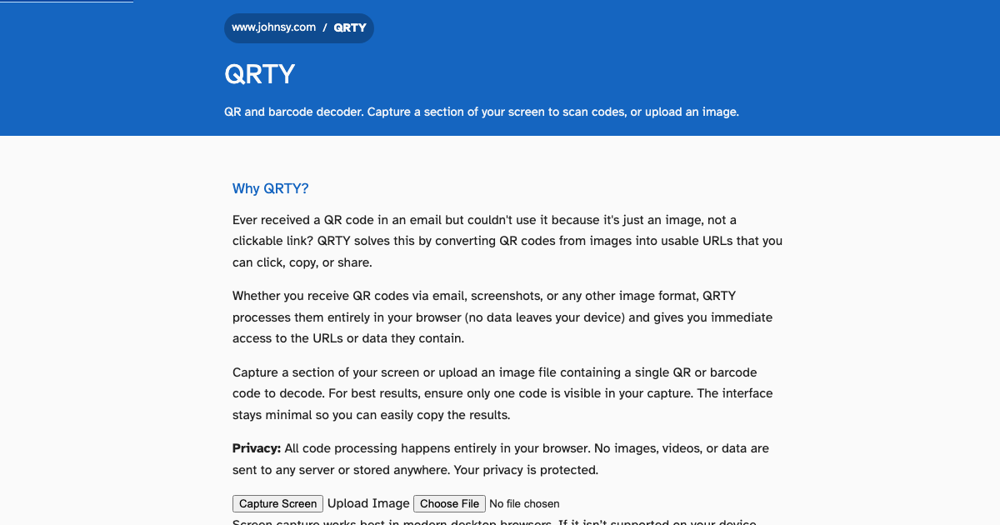

# QRTY

QR and barcode decoder using screen capture or image upload. Capture a section of your screen to automatically scan codes, or upload an image file.

## Why QRTY?

Have you ever received a QR code in an email and wanted to use it, but it's just an image, not a clickable link? QRTY solves this problem by letting you quickly convert QR codes from images into usable URLs that you can click, copy, or share.

Whether you receive QR codes via email, screenshots, or any other image format, QRTY processes them entirely in your browser (no data leaves your device) and gives you immediate access to the URLs or data they contain.

## Features

- Capture your screen to automatically detect QR codes and barcodes
- Upload image files containing QR or barcode data
- Automatically decode multiple codes in a single capture or image
- Open or share decoded URLs (with clipboard fallback) or copy any decoded text
- Fully keyboard accessible
- Minimal interface that doesn't block QR codes
- Styled to match www.johnsy.com design, including header with breadcrumbs and footer
- Privacy-focused: all processing happens locally in your browser

## Setup

This project uses [mise](https://mise.jdx.dev) for managing software versions and [pnpm](https://pnpm.io) for package management.

### Prerequisites

1. Install mise if you haven't already:

```bash
curl https://mise.run | sh
```

Or follow the [official installation instructions](https://mise.jdx.dev/getting-started.html).

2. Ensure mise is initialised in your shell (add to your shell config if needed):

```bash
eval "$(mise activate zsh)"  # for zsh
# or
eval "$(mise activate bash)" # for bash
```

### Installation

1. Install the required software versions (Node.js and pnpm):

```bash
mise install
```

2. Install project dependencies:

```bash
pnpm install
```

## Usage

The application is a web app hosted at `www.johnsy.com/QRTY/`. To use it:

1. Click "Upload Image" to upload an image file containing a QR code or barcode
2. Any decoded values will be displayed automatically
3. Use the action buttons to open, share, or copy decoded values
4. Press `Escape` to reset the results view
5. You can also click "Capture Screen" in desktop browsers that support screen sharing; unsupported browsers will show an error and you can fall back to the upload option

## Screenshots



## Iconography

- Primary app icon:

  

- Meta QR code (links to the hosted app):

  

## Keyboard Shortcuts

- `Space` (when screen capture is available) - Start/stop screen capture
- `Escape` - Stop capture or reset the results view

## Development

- `pnpm dev` - Run local development server
  - Served from `http://localhost:5173/QRTY/`
  - Use `pnpm dev --host` to bind to your local network (e.g. `http://<your-ip>:5173/QRTY/`) for testing on phones/tablets
- `pnpm preview` - Preview the production build locally
  - Served from `http://localhost:4173/QRTY/` by default
- `pnpm run lint` - Run ESLint
- `pnpm run format` - Format code with Prettier
- `pnpm run format:check` - Check code formatting with Prettier
- `pnpm run typecheck` - Run TypeScript checks (includes renderer helpers and build scripts)
- `pnpm run generate:icons` - Generate icon files from SVG
- `pnpm run generate:og-image` - Generate OpenGraph image
- `pnpm run generate:qr-code` - Generate QR code image for the site URL
- `pnpm run generate:all` - Generate all assets
- `pnpm run build` - Build the site and assets into `dist/` (runs Vite build, copies sitemap and `.nojekyll`, and generates icons, OG image, and QR code)
- `pnpm run lighthouse` - Run Lighthouse (performance, accessibility, best-practices, SEO) against the preview server; fails if accessibility, best-practices, or SEO score below 100 (used in CI and pre-push)

## Requirements

- Modern web browser with screen capture API support (Chrome, Firefox, Edge, Safari)
- HTTPS connection (required for screen capture API)

## Deployment

### GitHub Pages

The app uses a unified CI/CD workflow (see `.github/workflows/ci.yml`):

1. On pull request or push to `main`, the workflow runs: build (with dist cache), lint-test, Lighthouse (accessibility and related audits), and HTML validation
2. On push to `main`, if all jobs pass, the site is built and deployed to GitHub Pages via the deploy job
3. Configure the repository’s GitHub Pages source to use the “GitHub Actions” deployment method

**Dependabot**: Weekly dependency and GitHub Actions updates (labels: `dependencies`); minor and patch are grouped. The auto-merge workflow enables merge when CI passes. Require the CI/CD status checks on `main` via branch protection so dependency PRs only merge after success, e.g.:

```bash
./scripts/set-branch-protection.sh
```

This requires the `build`, `lint-test`, `lighthouse`, and `validate-html` checks to pass before merging (including Dependabot PRs).

### Manual Deployment

To manually deploy to `www.johnsy.com/QRTY/`:

1. Generate assets: `pnpm run build`
2. Upload the contents of the `dist/` directory to the web server at `/QRTY/`
3. Ensure the `.nojekyll` file is included (prevents Jekyll processing on GitHub Pages) - this is generated into `dist/` during the build

The app uses only static files (HTML, CSS, JavaScript) and CDN-hosted libraries (jsQR and ZXing), so no server-side processing is required.

## License

MIT
