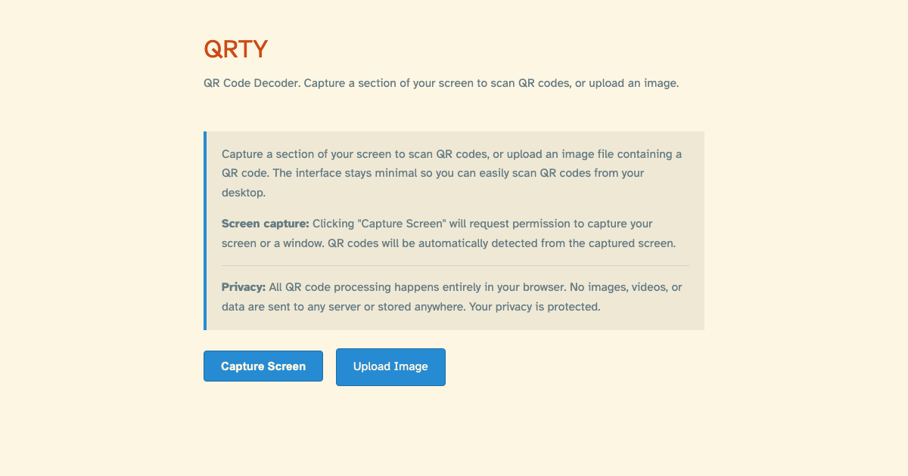

# QRTY

QR and barcode decoder using screen capture or image upload. Capture a section of your screen to automatically scan codes, or upload an image file.

## Features

- Capture your screen to automatically detect QR codes and barcodes
- Upload image files containing QR or barcode data
- Automatically decode multiple codes in a single capture or image
- Open or share decoded URLs (with clipboard fallback) or copy any decoded text
- Fully keyboard accessible
- Minimal interface that doesn't block QR codes
- Styled to match johnsy.com design
- Privacy-focused: all processing happens locally in your browser

## Setup

This project uses [mise](https://mise.jdx.dev) for managing software versions and [pnpm](https://pnpm.io) for package management.

### Prerequisites

1. Install mise if you haven't already:

```bash
curl https://mise.run | sh
```

Or follow the [official installation instructions](https://mise.jdx.dev/getting-started.html).

2. Ensure mise is initialised in your shell (add to your shell config if needed):

```bash
eval "$(mise activate zsh)"  # for zsh
# or
eval "$(mise activate bash)" # for bash
```

### Installation

1. Install the required software versions (Node.js and pnpm):

```bash
mise install
```

2. Install project dependencies:

```bash
pnpm install
```

## Usage

The application is a web app hosted at `johnsy.com/QRTY/`. To use it:

1. Click "Upload Image" to upload an image file containing a QR code or barcode
2. Any decoded values will be displayed automatically
3. Use the action buttons to open, share, or copy decoded values
4. Press `Escape` to reset the results view
5. You can also click "Capture Screen" in desktop browsers that support screen sharing; unsupported browsers will show an error and you can fall back to the upload option

## Screenshots



## Iconography

- Primary app icon:

  

- Meta QR code (links to the hosted app):

  

## Keyboard Shortcuts

- `Space` (when screen capture is available) - Start/stop screen capture
- `Escape` - Stop capture or reset the results view

## Development

- `pnpm start` - Run local development server
  - Served from `http://localhost:8000/QRTY/`
  - Also binds to your local network (e.g. `http://<your-ip>:8000/QRTY/`) so you can test on phones/tablets
- `pnpm run lint` - Run ESLint
- `pnpm run format` - Format code with Prettier
- `pnpm run typecheck` - Run TypeScript checks (includes renderer helpers and build scripts)
- `pnpm run generate:icons` - Generate icon files from SVG
- `pnpm run generate:og-image` - Generate OpenGraph image
- `pnpm run generate:qr-code` - Generate QR code image for the site URL
- `pnpm run generate:all` - Generate all assets
- `pnpm run build` - Generate all assets (alias for generate:all)

## Requirements

- Modern web browser with screen capture API support (Chrome, Firefox, Edge, Safari)
- HTTPS connection (required for screen capture API)

## Deployment

### GitHub Pages

The app is set up for automatic deployment to GitHub Pages:

1. Push to the `main` branch
2. GitHub Actions will automatically build and deploy to GitHub Pages
3. Configure GitHub Pages settings to serve from the `src` directory

### Manual Deployment

To manually deploy to `johnsy.com/QRTY/`:

1. Generate assets: `pnpm run build`
2. Upload the contents of the `src/` directory to the web server at `/QRTY/`
3. Ensure the `.nojekyll` file is included (prevents Jekyll processing on GitHub Pages)

The app uses only static files (HTML, CSS, JavaScript) and CDN-hosted libraries (jsQR and ZXing), so no server-side processing is required.

## License

MIT
